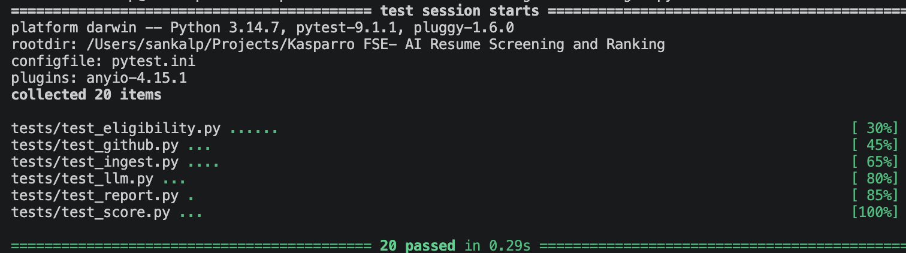
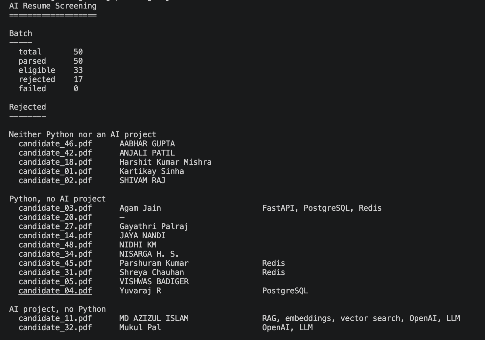
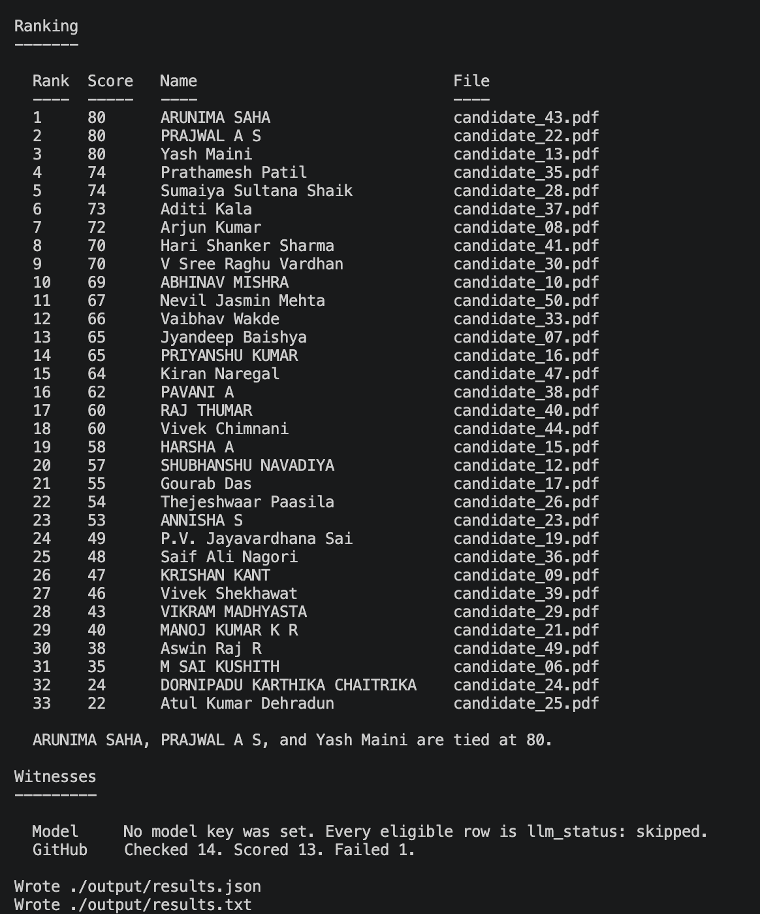
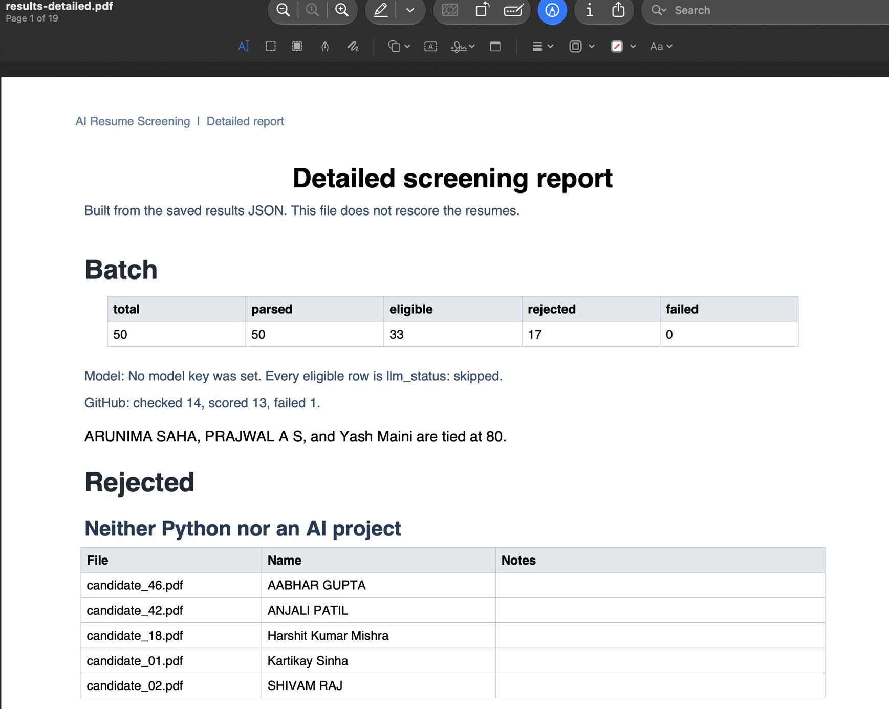
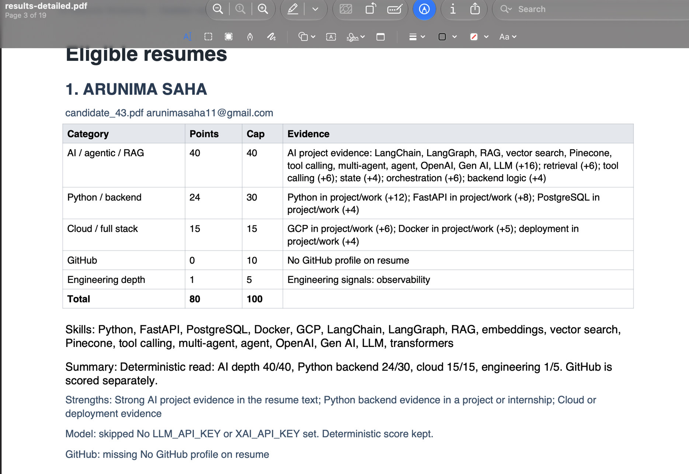
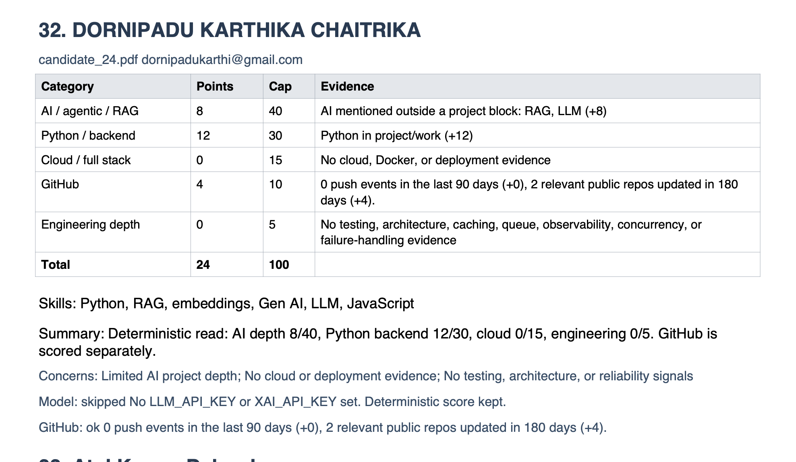

# Kasparro FSE AI Resume Screening & Ranking
Assignment

This is a command-line program. It reads a folder of PDF resumes and writes a ranked shortlist for an SDE internship that needs real Python and a practical AI or agentic project.

Python code decides who is eligible, what the score caps are, and how people are ranked. A language model and the public GitHub API only supply evidence. If either one fails for a single resume, that person keeps the rule-based result and everyone else is still processed.

There is no website and no API server. The program runs once and writes a JSON file.

## How to run

From this folder:

```bash
python main.py --input ./resumes --output ./output/results.json
```

If you are setting the project up on a new machine:

```bash
python -m venv .venv
source .venv/bin/activate
pip install -r requirements.txt
```

Python 3.11 or newer is required.

When the run finishes, the terminal prints a short report: batch counts, one line per rejected resume, the ranking table, and two witness lines. The same report is saved as `output/results.txt`. Score details for each person stay in `output/results.json`.

### Optional key

Scoring does not need an API key. The saved run does not call a model.

```bash
cp .env.example .env
```

| Variable | What it does |
| --- | --- |
| `GITHUB_TOKEN` | Optional. Raises the public GitHub rate limit. Leave it empty to use the unauthenticated API. |

Eligible rows stay `llm_status: skipped` and keep the rule-based score.

### Tests

```bash
pytest
```

The tests check the hard filter, the score caps and penalties, a model quote that is not in the resume, a model call that crashes on one chosen file, GitHub caching and a 404, a corrupt PDF that does not stop the next file, and a PDF built from saved JSON that leaves that JSON unchanged.

[Image #3] shows that run: 20 tests passed.



## What the output contains

The run writes two files.

`output/results.txt` is the short report: batch counts, rejected people one per line, the ranking table, and the model and GitHub lines. This is the same text the terminal prints.

[Image #1] shows the batch counts and the rejected groups.



[Image #2] shows the ranking table and the witness lines. Arunima Saha, Prajwal A S, and Yash Maini are tied at 80. GitHub scored 13 of 14 profiles.



`output/results.json` is the same result for a program to read. It has three parts.

`batch_summary` counts the folder: `total`, `parsed`, `eligible`, `rejected`, and `failed`.

`reasoning` repeats the sections from the text report: rejected groups, the top-score tie, the model note, and the GitHub counts.

`candidates` is the full list. Eligible people come first, highest score first, then by name. Rejected and unreadable files follow.

An eligible row includes:

- `total_score` out of 100
- `score_breakdown` for the five categories
- `score_evidence`, one line per category, quoting what earned the points
- `matched_skills`
- `project_summary`
- `strengths` and `concerns`
- `github_status` and `github_summary`
- `llm_status` and `llm_note`

A rejected row has `eligible: false`, `rejection_reasons`, and the skills that were found. The model is not called for that person.

On the 50 resumes in `resumes/`, the last run parsed every file: 33 eligible, 17 rejected, 0 failed.

## Detailed PDF (Additional Feature)

An additional feature writes a very detailed result PDF from the JSON the screener already saved. It does not screen the resumes again, and it does not change `output/results.json` or `output/results.txt`.

```bash
python pdf_report.py --input ./output/results.json --output ./output/results-detailed.pdf
```

The PDF keeps every metric from that run.

The batch table has five counts: total, parsed, eligible, rejected, and failed. The rejected tables split people into three groups: neither Python nor an AI project; Python with no AI project, with the backend skills that were found; and an AI project with no Python, with those AI skills kept. The ranking table lists rank, score, name, and file for every eligible person.

Each eligible person then has a score table. The five metrics, and their caps, are:

| Metric | Cap | What the row shows |
| --- | --- | --- |
| AI / agentic / RAG | 40 | Points, plus the evidence line for the project or skills-list match |
| Python / backend | 30 | Points for Python, FastAPI, async, PostgreSQL, and Redis |
| Cloud / full stack | 15 | Points for GCP, Docker, deployment, and React or Next.js when backend work is also present |
| GitHub | 10 | Points for recent pushes and relevant public repos, or zero when no profile was found |
| Engineering depth | 5 | Points for testing, architecture, caching, queues, observability, concurrency, and failure handling |
| Total | 100 | Sum of the five metrics |

Under the table the PDF lists matched skills, the project summary, strengths, concerns, the model status, and the GitHub status.

[Image #4] is the first page: the batch counts, the tie at 80, and the rejected groups.



[Image #5] is an eligible person at the top of the ranking. Arunima Saha scores 80, with all five metrics, the evidence lines, skills, summary, strengths, and the model and GitHub lines.



[Image #6] is the same table lower in the ranking. Dornipadu Karthika Chaitrika scores 24, with concerns and a GitHub score of 4.



## Architecture

`main.py` loads `.env`, screens the folder, ranks the rows, and writes the JSON file.

```text
resumes/*.pdf
    │
    ▼
ingest.py          read each PDF; one bad file does not stop the batch
    │
    ▼
extract.py         name, email, GitHub username, skills, projects, work
    │
    ▼
eligibility.py     hard filter: Python AND an AI/agent term. No model call.
    │
    ├─ fail ──────────► row with rejection reasons. The model is not called.
    │
    ▼
score.py           deterministic score out of 100, with an evidence line per category
    │
    ▼
llm.py             optional witness. May adjust only AI depth, and only with a quote
                   that actually appears in that resume. A failure stays on that row.
    │
    ▼
github_enrich.py   optional witness. Up to 10 points. A 404 or rate limit scores 0.
    │
    ▼
report.py          eligible people first, highest score first, then name
    │
    ▼
output/results.json
```

`config.py` holds the score caps and the environment variable names. `models.py` holds the data shapes for a parsed resume, a score card, and the model's testimony. `pipeline.py` runs one resume and then the whole folder. A failure inside one resume is caught there and does not cancel the rest.

### ingest.py

Walks the input folder and reads PDFs with `pypdf`. Dotfiles such as `.DS_Store` are ignored. A file that cannot be read is stored as `failed` with the error. Two files with the same bytes are not scored twice.

### extract.py

Cleans PDF text without splitting real names such as `AbhinavMishra32` or `FastAPI`. It finds the email, a real `github.com/<user>` link, and the person's name from the header. A line that only says "GitHub" is not a profile. Skills, projects, and experience are split on headings such as `TECHNICAL SKILLS` and `WORK EXPERIENCE`.

### eligibility.py

This is the gate. A resume passes only when both are true:

- The word `python` appears. `pythonic` does not count. A PDF split such as `Pyt hon` still counts.
- An agentic term appears as a whole word: LangChain, LangGraph, LlamaIndex, Google ADK, RAG, embeddings, vector search or pgvector, FAISS, Chroma, Pinecone, tool calling, agent, multi-agent, OpenAI, Gen AI, LLM, Hugging Face, or transformers.

`rag` inside words such as coverage, storage, or Kharagpur does not count. GitHub Copilot and "AI-assisted development" do not count. A TensorFlow, PyTorch, or scikit-learn line does not count on its own. Java, JavaScript, React, and Next.js may appear on a passing resume. They are not enough by themselves.

Someone who fails here is not scored and the model is not called. The skills that were found stay on the row. A JavaScript RAG resume is rejected for lack of Python, and the RAG skills remain visible. A strong FastAPI resume with PostgreSQL and Redis is rejected when it has no AI project.

### score.py

Only people who pass the gate are scored. Text inside a project or a job is worth more than the same word on a skills list. Each category stores a one-line evidence string.

| Category | Cap | How points are earned |
| --- | --- | --- |
| AI / agentic / RAG | 40 | 16 points when an AI term is in a project or job. Extra points for retrieval, tool calling, state, orchestration, evaluation, and backend logic in that same text. 8 points when the AI term is only on a skills list. |
| Python / backend | 30 | Python 12 or 6, FastAPI 8 or 3, async 4 or 1, PostgreSQL 4 or 1, Redis 2 or 1. The higher number is project text. The lower number is a skills list. |
| Cloud / full stack | 15 | GCP 6 or 2, Docker 5 or 2, deployment 4 or 1. React or Next.js adds 3 only when the resume also shows backend or deployment work. |
| GitHub | 10 | Up to 5 for push events in the last 90 days. Up to 5 for public Python or AI repos updated in the last 180 days. |
| Engineering depth | 5 | One point each for testing, architecture, caching, queues, observability, concurrency, and failure handling in project or work text. |

A project that only mentions an LLM, with no retrieval, tools, state, orchestration, evaluation, or backend logic, loses 10 points from AI depth. A tutorial or a clone loses 8 more. The floor is 0. The five categories sum to at most 100.

### llm.py

This is the only file that calls a model. It asks for a project summary, strengths, concerns, and one quote copied from the resume. The pipeline applies an AI-depth change from -15 to +10 only when that quote appears in the resume and is at least 12 characters. The model cannot change eligibility, the name, the email, or the skills.

On the saved run the model is not called. Eligible rows are `skipped` and keep the rule-based score. A timeout, an empty response, bad JSON, or a rate limit would be `failed` on that row only.

### github_enrich.py

For eligible people who have a profile URL, this calls the public GitHub API. Up to 5 points come from recent push events, and up to 5 from public Python or AI repos updated in the last 180 days. The same username is fetched once per run. A missing URL scores 0. A 403, 404, timeout, or rate limit scores 0 for that person and the batch continues. Profiles on rejected resumes are not fetched.

### report.py

Sorts eligible people by score, then by name. Writes the batch counts and the `reasoning` sentences.

## Design Decisions

**Code is the judge.** Eligibility comes from the rules above. A failed hard filter is final, and the model is not asked to overturn it. Scores start from the table. The model may only move AI depth, inside 0–40, and only with a quote that is actually in that resume.

**GitHub is the same kind of witness.** The API can add up to 10 points. It cannot reject a candidate, and a failed request cannot reject the batch.

**One bad input cannot take down the run.** One unreadable PDF, one GitHub 404, or one model timeout is recorded on that row. The other resumes are still ranked.

**Project text outranks a skills list.** Listing LangGraph on a skills line is worth less than describing a LangGraph project. A well-written JavaScript or Java resume still fails the hard filter.

**The README and the JSON have to be explainable.** Every category has an evidence line, and `reasoning` states the notable decisions for the folder that was just screened.

## If I Had More Time

- Parse DOCX resumes alongside PDF.
- Call the model and GitHub with a bounded async pool so a 50-resume folder finishes faster.
- Cache GitHub and model results on disk across runs, keyed by file hash and username.
- Add a small FastAPI layer with `POST /screen` and `GET /results`. The assignment does not require an API. The command above is the interface.
